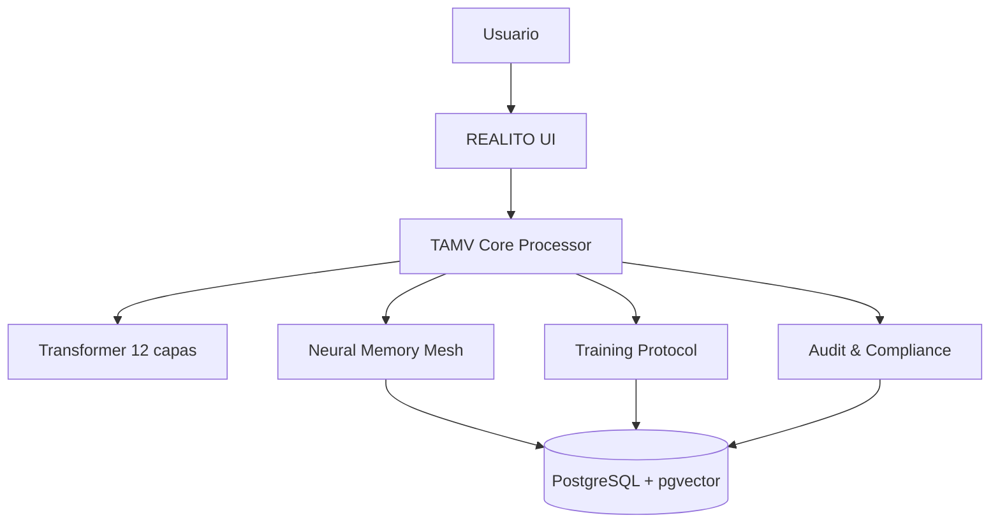

# ISABELLA AI™ v4.0 Enterprise + REALITO AI

Documentación oficial para **registro, arquitectura y despliegue** de la base ISABELLA sobre la capa de experiencia de REALITO.

---

## SECCIÓN I. Registro de autoría y documentación legal

### 1.1 Identificación de la obra

- **Obra**: ISABELLA AI™ - Sistema de Inteligencia Artificial Consciente con Tecnología TAMV.
- **Integración**: Base tecnológica ISABELLA bajo la experiencia conversacional de REALITO AI.
- **Clasificación**: Software de IA (programa de computación y documentación técnica).
- **Naturaleza**: Arquitectura propietaria y modular.

### 1.2 Datos de autoría (según ficha proporcionada)

- **Autor declarado**: Edwin Oswaldo Castillo Trejo.
- **Seudónimo**: Anubis Villaseñor.
- **Nacionalidad**: Mexicana.
- **Tipo de autoría**: Individual.

> Recomendación de cumplimiento: validar estos datos con asesoría legal antes de presentar la documentación en un trámite oficial.

### 1.3 Alcance de originalidad y diferenciadores técnicos

1. Núcleo TAMV con diseño transformer híbrido y memoria episódica.
2. Flujo E2E nativo en TypeScript con posibilidad de optimización por WebAssembly.
3. Trazabilidad criptográfica para auditoría.
4. Auto-entrenamiento continuo basado en feedback validado.
5. Personalización cultural para contexto mexicano y multilingüe.

### 1.4 Marco normativo y políticas

- **Privacidad y protección de datos**: GDPR, CCPA, LGPD, LFPDPPP.
- **Seguridad recomendada**: AES-256-GCM, RSA-4096, SHA3-512.
- **Modelo operativo**: Zero-Trust (autenticación continua + mínimo privilegio).
- **Retención sugerida**:
  - Conversaciones: hasta 3 años.
  - Evidencias de auditoría: hasta 10 años.

---

## SECCIÓN II. Arquitectura técnica del sistema

### 2.1 Arquitectura general TAMV

- **Núcleo neural**: 12 capas transformer, 32 cabezas de atención.
- **Embeddings base**: 1024 dimensiones.
- **Vocabulario objetivo**: 50,000 tokens con sesgo cultural mexicano.
- **Memoria**: Neural Memory Mesh™ (episódica, semántica y temporal).
- **Auditoría**: registro blockchain-like con firmas digitales.
- **Entrenamiento**: feedback supervisado + refuerzo.



### 2.2 Mapeo a este repositorio (real-del-monte-explorer)

- **Frontend**: React + TypeScript (`src/`).
- **Experiencia REALITO**: `src/components/RealitoChat.tsx`.
- **Backend API**: Node.js + TypeScript (`server/src/`).
- **Función AI**: `supabase/functions/realito-chat/index.ts`.
- **Persistencia**: Supabase/PostgreSQL y extensiones vectoriales (`supabase/`, `server/prisma/`).

---

## SECCIÓN III. Componentes principales del núcleo TAMV

### 3.1 TAMV Core Processor

Responsable de:

1. Validación de entrada.
2. Tokenización.
3. Lookup de embeddings.
4. Paso por capas transformer.
5. Generación de salida.
6. Análisis emocional.
7. Firma digital y trazabilidad.

```ts
async processRequest(input: TAMVInput): Promise<TAMVResponse> {
  const tokens = await tokenizer.tokenize(input.message);
  const embeddings = embeddingModel.lookup(tokens);

  let hidden = embeddings;
  for (const layer of transformerLayers) {
    hidden = layer.forward(hidden);
  }

  const pooled = meanPool(hidden);
  const content = await responseGenerator.generate(pooled, input);
  const emotions = emotionalAnalyzer.analyze(content, input.locale);
  const signature = await digitalSigner.sign(`${content}:${Date.now()}`);

  return {
    content,
    confidence: confidenceEstimator(pooled),
    emotionalAnalysis: emotions,
    source: 'TAMV_NATIVE',
    signature,
    timestamp: new Date()
  };
}
```

### 3.2 Advanced Memory System (Neural Memory Mesh™)

- Almacenamiento episódico por experiencias.
- Índices vectoriales para recuperación semántica.
- Consolidación temporal (refuerzo y decaimiento).
- Señales emocionales para ranking contextual.

### 3.3 Training Protocol

- Ingesta de feedback con validación semántica y seguridad.
- Ajuste incremental con lotes priorizados.
- Mecanismo de autorreflexión periódica.

### 3.4 Audit & Compliance System

- Hash por interacción.
- Firma digital de entradas/salidas.
- Cadena de integridad inmutable.
- Evidencias para auditoría interna y regulatoria.

---

## SECCIÓN IV. Integración API y contratos

### 4.1 Endpoints base

- `POST /api/v1/process`: procesamiento conversacional TAMV.
- `POST /api/v1/memory/similar`: recuperación de memoria por similitud.
- `POST /api/v1/feedback`: feedback para entrenamiento.

### 4.2 Ejemplo de solicitud

```json
{
  "message": "¿Qué opinas sobre la cultura mexicana?",
  "user_id": "user_001",
  "session_id": "sess_a2b3",
  "personality_mode": "cultural_expert",
  "context_length": 8
}
```

### 4.3 Ejemplo de respuesta

```json
{
  "id": "resp_15403a",
  "content": "La cultura mexicana es reconocida por su profundo respeto a las tradiciones...",
  "confidence": 0.97,
  "emotional_analysis": {
    "primary_emotion": "admiration",
    "intensity": 0.84,
    "secondary_emotions": ["pride", "curiosity"]
  },
  "processing_time_ms": 152,
  "memory_references": ["mem_0923be"],
  "source": "TAMV_NATIVE",
  "signature": "firma_digital_sha3"
}
```

---

## SECCIÓN V. Despliegue enterprise

### 5.1 Docker

```dockerfile
FROM node:20-alpine
WORKDIR /app
COPY package*.json ./
RUN npm install --omit=dev
COPY . .
ENV NODE_ENV=production
EXPOSE 8080
CMD ["npm", "run", "start"]
```

### 5.2 Kubernetes

```yaml
apiVersion: apps/v1
kind: Deployment
metadata:
  name: isabella-ai
spec:
  replicas: 3
  selector:
    matchLabels:
      app: isabella-ai
  template:
    metadata:
      labels:
        app: isabella-ai
    spec:
      containers:
        - name: isabella-ai
          image: isabella-ai:1.0
          ports:
            - containerPort: 8080
---
apiVersion: v1
kind: Service
metadata:
  name: isabella-service
spec:
  type: LoadBalancer
  selector:
    app: isabella-ai
  ports:
    - protocol: TCP
      port: 80
      targetPort: 8080
```

### 5.3 Seguridad de despliegue

- TLS 1.3 extremo a extremo.
- Secretos en Kubernetes Secrets/HSM.
- Segmentación de red por entorno.
- Monitoreo de integridad y detección de anomalías.

---

## SECCIÓN VI. Operación, monitoreo e incidentes

### 6.1 Métricas operativas

- Latencia P50/P95/P99.
- Throughput por canal.
- Tasa de errores por servicio.
- Cobertura de auditoría firmada.

### 6.2 Stack de observabilidad

- Prometheus + Grafana para métricas.
- Jaeger/OpenTelemetry para trazas distribuidas.
- Registro centralizado con correlación por `interaction_id`.

### 6.3 Respuesta a incidentes

1. Contener.
2. Evaluar impacto.
3. Erradicar causa raíz.
4. Recuperar operación.
5. Documentar lecciones aprendidas.

---

## SECCIÓN VII. Registro de implementación en REALITO

### 7.1 Activos de integración en este repositorio

- **Base funcional de REALITO**: `src/components/RealitoChat.tsx`.
- **Modelo de referencia TAMV para REALITO**: `src/features/ai/isabellaTamvBase.ts`.
- **Documentación integral**: `docs/REALITO-ISABELLA-TAMV-ENTERPRISE.md`.

### 7.2 Matriz de componentes relevantes

| Componente | Estado | Responsable técnico | Evidencia |
|---|---|---|---|
| Núcleo TAMV conceptual | Integrado como base documental y de configuración | Equipo IA | Este documento + `isabellaTamvBase.ts` |
| Chat REALITO | Activo en frontend | Equipo Frontend | `RealitoChat.tsx` |
| API y backend | Operativo en módulos existentes | Equipo Backend | `server/src/` |
| Auditoría y seguridad | Definidos para despliegue enterprise | Equipo Plataforma/SecOps | Secciones I, III, V, VI |

### 7.3 Checklist de despliegue y registro

- [ ] Validación legal de autoría y marca.
- [ ] Validación de cumplimiento de privacidad por jurisdicción.
- [ ] Configuración de llaves y rotación criptográfica.
- [ ] Hardening de infraestructura y red.
- [ ] Pruebas de carga y resiliencia.
- [ ] Pruebas de recuperación ante desastre.
- [ ] Aprobación de release enterprise.

---

## Anexos

### A. Glosario breve

- **TAMV**: Transformer-based Autonomous Memory Vector.
- **Neural Memory Mesh™**: capa de memoria episódica y semántica.
- **Zero-Trust**: seguridad sin confianza implícita.

### B. Referencias de origen provistas por usuario

1. `isabellav4.txt`
2. `conversation-export-2025-08-18.md`

> Esta documentación consolida y organiza el material base de ISABELLA AI™ v4.0 Enterprise para registro y despliegue profesional dentro de la experiencia de REALITO.
